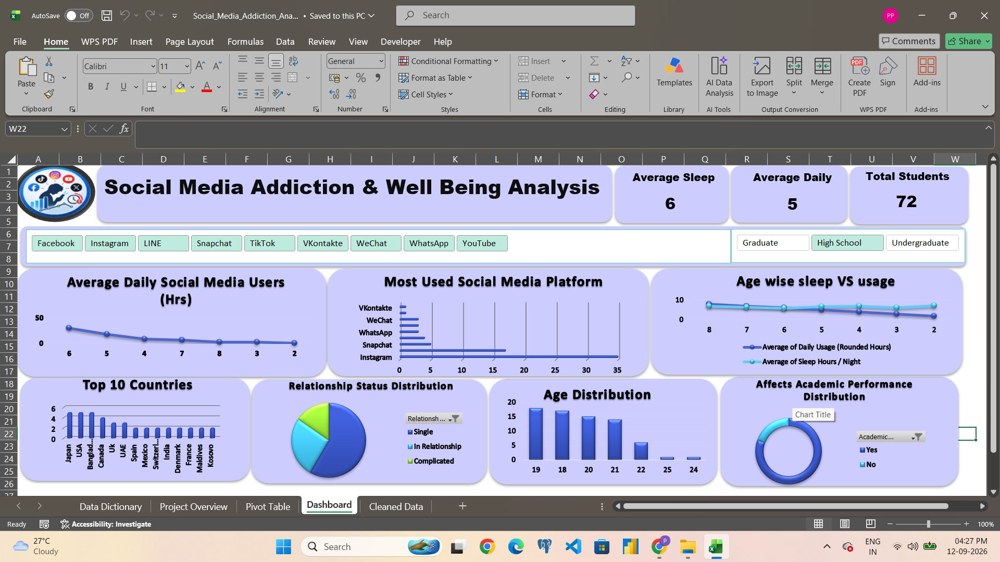

# 📊 Student Social Media Addiction & Well-Being Analytics

## 📌 Project Overview

This project analyzes social media usage patterns among students and explores
their association with addiction risk, sleep, academic performance,
demographics, and overall well-being.

The project demonstrates an end-to-end Excel Data Analytics workflow including
data preparation, validation, calculated fields, Pivot Tables, Pivot Charts,
KPI analysis, interactive filters, and dashboard visualization.

> **Note:** The findings represent patterns and associations observed in the
> dataset and should not be interpreted as causal relationships.

---

## 🎯 Business Question

**How are social media usage patterns associated with academic impact,
sleep, well-being, and addiction risk among students?**

---

## 🎯 Project Objectives

- Analyze daily social media usage patterns
- Identify the most-used social media platforms
- Examine usage intensity against addiction scores
- Compare social media usage with sleep duration
- Analyze academic-performance impact
- Explore age, country, gender, and education-level patterns
- Analyze relationship-status distribution
- Develop meaningful analytical KPIs
- Create an interactive Excel dashboard
- Generate actionable insights and recommendations

---

## 📈 Dashboard Preview

The interactive dashboard provides an executive view of social media usage,
addiction risk, sleep patterns, platform preferences, demographics, and
academic-performance impact.

---

## 📊 Key Performance Indicators

| KPI | Value |
|---|---:|
| Total Students | 2,000 |
| Average Daily Social Media Usage | 5.04 hrs |
| Average Addiction Score | 7.57 |
| Average Sleep | 6.83 hrs |
| Academic Impact | 63.55% |
| High Addiction | 76.35% |
| High-Usage Students | 1,662 |

---

## 🛠️ Tools & Techniques

### Tools

- Microsoft Excel
- WPS Office

### Analytical Techniques

- Data Cleaning
- Data Validation
- Data Quality Checks
- Data Transformation
- Calculated Fields
- Pivot Tables
- Pivot Charts
- KPI Development
- Exploratory Data Analysis
- Data Visualization
- Interactive Dashboarding

---

## 🧹 Data Preparation & Quality Checks

The dataset was reviewed and validated before analysis.

Key validation results:

- **2,000 total records**
- **0 duplicate Student IDs**
- **3 missing values in key fields requiring review**
- **0 invalid daily-usage values outside the 0–24 hour range**
- **0 invalid sleep-hour values outside the 0–24 hour range**
- **0 addiction scores outside the 1–10 range**
- **0 negative conflict scores**

These checks help ensure consistency and reliability throughout the analysis.

---

## 📊 Usage Category Analysis

Students were segmented into four daily social-media usage categories:

| Usage Category | Daily Usage | Students | Avg. Addiction | Avg. Sleep |
|---|---:|---:|---:|---:|
| Low | <2 hrs | 13 | 5.46 | 6.76 hrs |
| Moderate | 2–4 hrs | 325 | 6.25 | 7.09 hrs |
| High | 4–6 hrs | 1,103 | 7.41 | 6.96 hrs |
| Very High | >6 hrs | 559 | 8.71 | 6.43 hrs |

The Very High usage group shows the highest average addiction score and the
lowest average sleep duration among the usage categories.

---

## 🔍 Platform Analysis

The project compares social media platforms based on student usage and
average addiction scores.

| Platform | Students | Avg. Addiction Score |
|---|---:|---:|
| Instagram | 686 | 7.61 |
| TikTok | 447 | 7.89 |
| Facebook | 371 | 7.32 |
| Twitter | 77 | 7.39 |
| LinkedIn | 55 | 6.33 |
| YouTube | 29 | 7.79 |

Instagram has the highest number of students among the platforms represented
in the analysis.

---

## 😴 Sleep Analysis

Sleep duration was categorized to identify patterns in student well-being.

| Sleep Category | Students | Share |
|---|---:|---:|
| Sleep Deficit (<6 hrs) | 458 | 22.90% |
| Healthy Sleep (>7 hrs) | 923 | 46.15% |

The dashboard enables sleep patterns to be compared with social media usage
and addiction scores.

---

## 🎓 Academic Performance Analysis

Overall:

- **1,271 students (63.55%)** are classified as experiencing academic
  performance impact.
- **729 students (36.45%)** are classified as having no academic-performance
  impact.

Academic impact can also be analyzed across usage categories, platforms,
academic levels, and demographic segments.

---

## 💡 Key Insights

### 1. Higher usage is associated with higher addiction scores

The average addiction score increases from **6.25** among Moderate users to
**8.71** among Very High users.

### 2. Higher usage is associated with lower average sleep

Average sleep decreases from **7.09 hours** among Moderate users to
**6.43 hours** among Very High users.

### 3. High usage is the largest usage segment

The High usage category contains **1,103 students**.

### 4. Very High users have the highest average addiction score

The Very High usage group records an average addiction score of **8.71**,
compared with an overall average of **7.57**.

### 5. Instagram is the most-used platform

Instagram has **686 students** represented in the analysis.

### 6. Academic impact affects a substantial proportion of students

**63.55%** of students are classified as experiencing academic-performance
impact.

### 7. Sleep deficit is an important well-being indicator

**458 students (22.90%)** fall into the Sleep Deficit category of fewer than
6 hours per night.

---

## 🎯 Recommendations

Based on the patterns identified in the analysis:

1. **Target high-usage groups** with digital-wellness awareness initiatives.

2. **Promote healthy sleep habits** among students with higher social-media
   usage.

3. **Provide academic support** to students showing academic impact alongside
   high usage.

4. **Investigate platform-level engagement patterns** where addiction scores
   appear relatively high.

5. **Encourage balanced digital habits** and responsible social-media usage.

6. **Use segmentation analysis** to identify differences across age,
   education level, country, platform, and relationship status.

---

## 📚 Excel Workbook Structure

The workbook contains:

### Data Dictionary
Definitions of dataset fields and analytical variables.

### Project Overview
Project objectives, business question, and analytical approach.

### Cleaned Data
Prepared dataset used for analysis.

### Pivot Table
Aggregated data used for analysis and dashboard visualizations.

### Dashboard
Interactive visual analysis using KPIs, charts, and filters.

---

## 🔎 Dashboard Analysis Areas

The dashboard enables analysis of:

- Average daily social media usage
- Most-used social media platforms
- Sleep vs. social media usage
- Age distribution
- Country-wise patterns
- Relationship status
- Academic level
- Academic-performance impact
- Addiction scores
- Usage categories
- Sleep categories

---

## ⚠️ Data Interpretation

This project uses an observational dataset. The analysis highlights
relationships and patterns within the data rather than establishing
cause-and-effect relationships.

The results should therefore be used for exploratory analysis, hypothesis
generation, and data-driven discussion.

---

## 💼 Portfolio Skills Demonstrated

This project demonstrates my ability to:

- Translate business questions into analytical KPIs
- Clean and validate datasets
- Create derived analytical categories
- Build Pivot Table-based analysis
- Design an executive-style Excel dashboard
- Analyze behavioral patterns
- Create meaningful visualizations
- Generate data-driven recommendations
- Communicate analytical findings clearly
- Present an end-to-end Excel analytics project

---

## 👩‍💻 Author

**Priyanka Patel**

**Data Analyst | Excel | SQL | Power BI | Python**

---

## ⭐ Project Objective

The objective of this project is to demonstrate an end-to-end Data Analytics
workflow — from data preparation and validation to exploratory analysis,
dashboard development, insight generation, and business recommendations.
